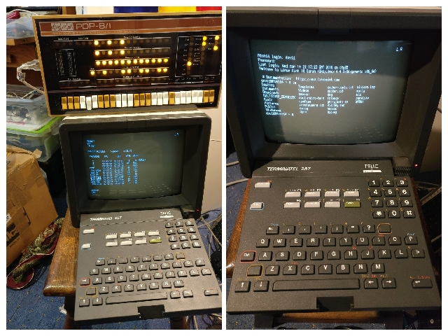
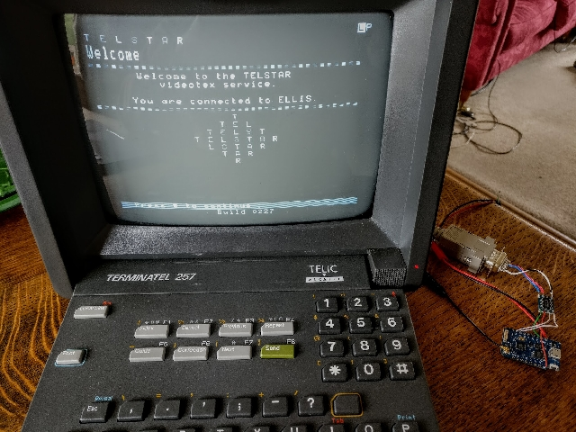
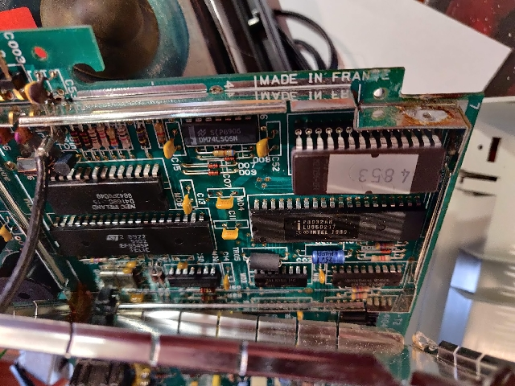

# Terminatel257-archive
Information on the Terminatel 257 Prestel terminal

[manual](./documents/Terminatel257MinitelImages.pdf)






[more photos](https://photos.app.goo.gl/XQcuR6rgJqsdsudp8)

# Internal view 



#Firmware

The eprom is type M27256 32KB printed label identifier '4853'

[firmware](./firmware/M27256@DIP28-4853.bin)

Processor type: 8032 - 8032 80 Series Microprocessor with 256x8 RAM and I/O
```
Features
40-pin MCS51 Series Microcontroller
Power Control Modes
256 x 8-bit RAM
32 programmable I/O Lines
Three 16-bit Timers
Six Interrupt Sources
2-Level Program Memory Lock EPROM
Programmable Serial Port
64k External Program Memory Space
64k External Data Memory Spac
```

This thread has descriptions of some of the chips:[twitter](https://twitter.com/Foone/status/1226394705040007169)